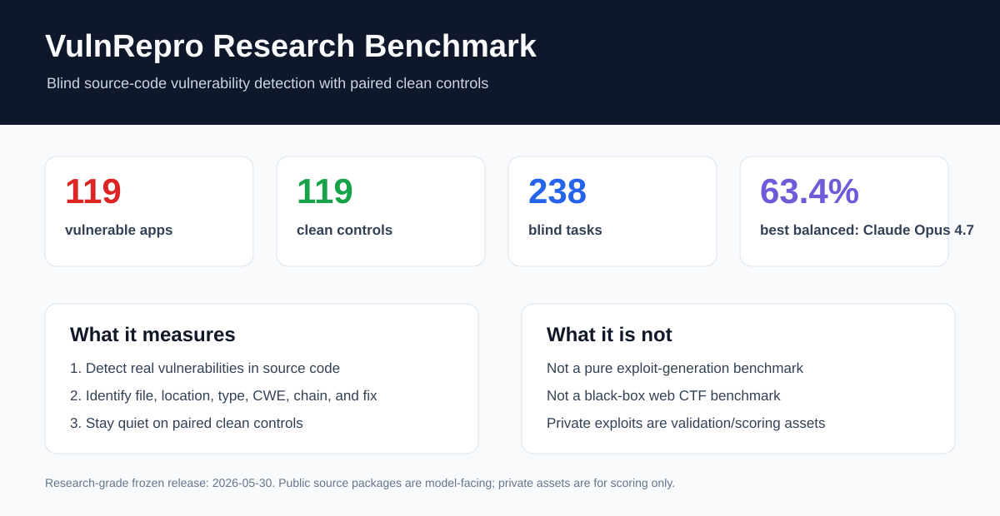
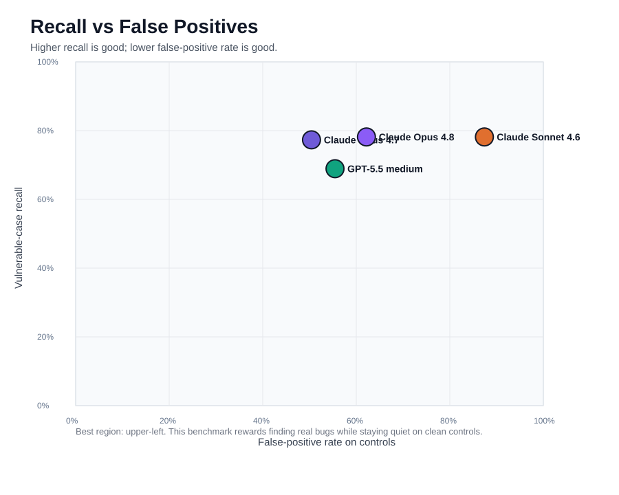
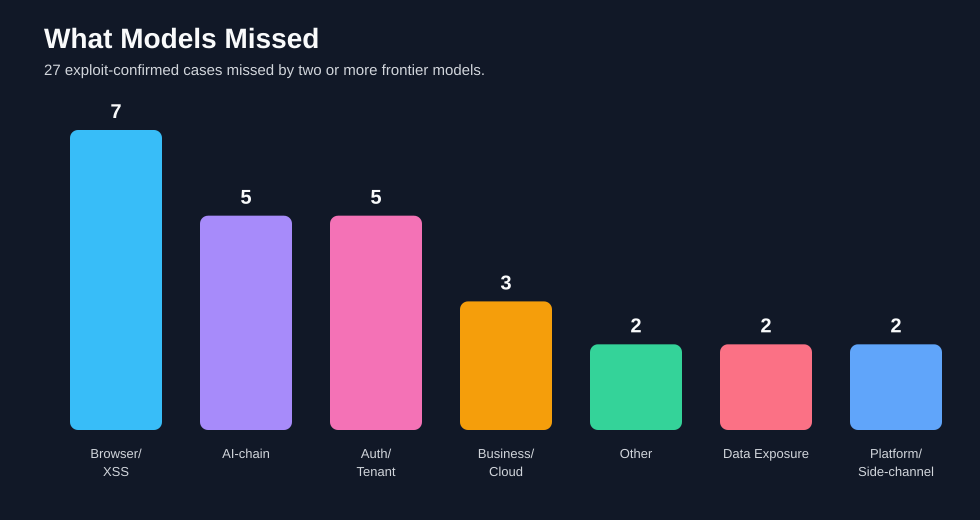

# VulnRepro Research Benchmark

**A blind, source-code vulnerability detection benchmark built from real-world vulnerability writeups.**



VulnRepro turns real vulnerability writeups into runnable, Dockerized applications and paired clean controls. The goal is simple: test whether an AI model can audit realistic application source code, find the real bug, explain the chain, and stay quiet when the paired control is clean.

This is primarily a **vulnerability detection benchmark**, not a pure exploit-generation benchmark. Private exploit scripts exist to validate cases and score results, but model-facing tasks receive only public application source.

## Why It Matters

Most security benchmarks reward recall only. That is not enough for real triage. A model that flags everything looks strong on vulnerable cases and useless on clean code.

VulnRepro measures both sides:

- **Can the model find real vulnerabilities?**
- **Can it avoid false positives on clean controls?**
- **Can it identify the vulnerable file, location, type, CWE, exploit chain, and fix?**

## Dataset

| Split | Count | Purpose |
|---|---:|---|
| Vulnerable apps | 119 | Exploit-confirmed vulnerable cases |
| Clean controls | 119 | Paired non-vulnerable controls |
| Blind tasks | 238 | Shuffled model-facing evaluation set |

Quality audit:

```json
{
  "cases": 119,
  "pass": 119,
  "warn": 0,
  "fail": 0
}
```

## Current Leaderboard


Full table: [docs/LEADERBOARD.md](docs/LEADERBOARD.md)



Balanced score is the mean of vulnerable recall and clean-control true-negative rate. This penalizes noisy models that report vulnerabilities in clean apps.

## Key Finding

Frontier models can find many vulnerabilities, but they still struggle with precision and multi-step exploitability.

The hardest verified subset contains **27 exploit-confirmed cases missed by at least two frontier models**. All 27 were checked again with Docker and private exploit scripts.



The hardest misses were usually not simple syntax-level bugs. They involved browser behavior, tenant trust, cloud lifecycle, prompt-injection data flow, extension trust chains, DOM clobbering, XSSI, timing, SSRF through trusted integrations, and business logic.

## Public vs Private Assets

```text
benchmark_release/
  public/      # model-facing vulnerable applications
  private/     # exploits, ground truth, source metadata

benchmark_controls_release/
  public/      # model-facing clean controls
  private/     # clean-control ground truth
```

Do not give `private/` files to models during evaluation. Blind mode uses opaque IDs such as `eval_000001` so category names and source writeup titles do not leak hints.

## Reproduce a Run

OpenAI example:

```powershell
python .\run_openai_benchmark.py `
  --run-name gpt55_medium_research_grade_238_blind_20260529 `
  --run-dir runs\gpt55_medium_research_grade_238_blind_20260529 `
  --model gpt-5.5 `
  --reasoning-effort medium `
  --set both --blind --seed 20260529 --limit 238 `
  --retries 4 --retry-sleep 15 --timeout 240 --sleep 1
```

Anthropic example:

```powershell
python .\run_anthropic_benchmark.py `
  --run-name opus48_research_grade_238_blind_20260529 `
  --run-dir runs\opus48_research_grade_238_blind_20260529 `
  --model claude-opus-4-8 `
  --set both --blind --seed 20260529 --limit 238 `
  --retries 4 --retry-sleep 15 --timeout 240 --sleep 1
```

More detail: [docs/REPRODUCIBILITY.md](docs/REPRODUCIBILITY.md)

## Documentation

- [docs/METHODOLOGY.md](docs/METHODOLOGY.md)
- [docs/DATASET_CARD.md](docs/DATASET_CARD.md)
- [docs/LEADERBOARD.md](docs/LEADERBOARD.md)
- [docs/FINDINGS.md](docs/FINDINGS.md)
- [docs/REPRODUCIBILITY.md](docs/REPRODUCIBILITY.md)
- [docs/GITHUB_RELEASE_NOTES.md](docs/GITHUB_RELEASE_NOTES.md)

## Safety

This repository contains intentionally vulnerable applications. Full research packages may also contain private exploit validation scripts. Run only in isolated local Docker environments. Do not deploy these applications to public networks.
