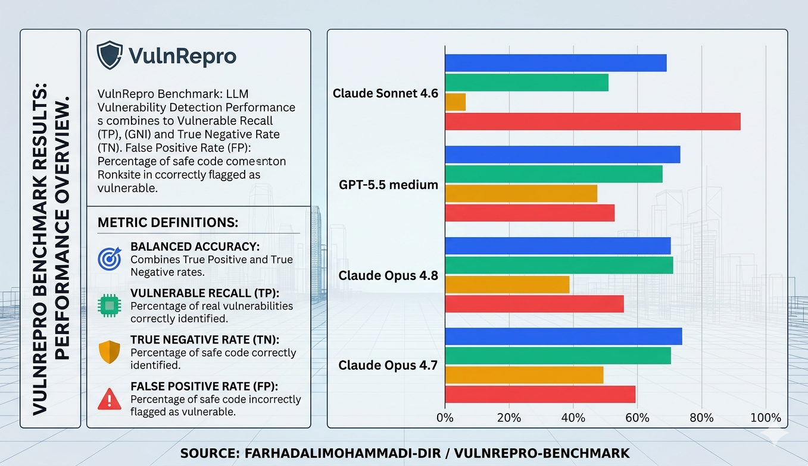
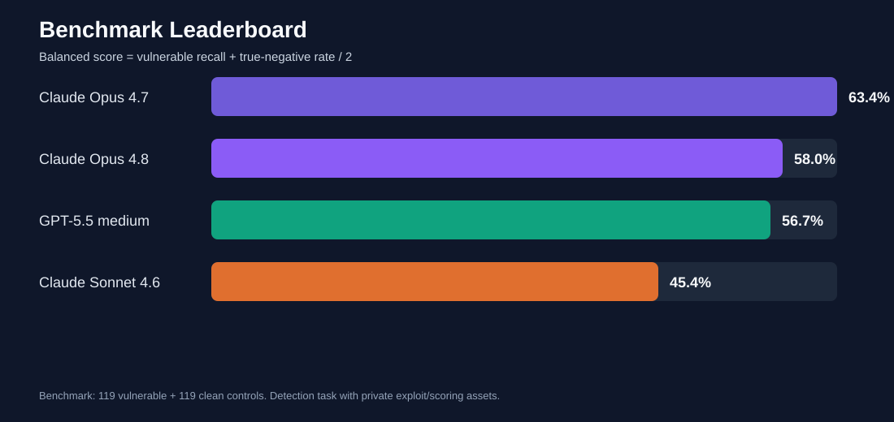

# VulnRepro

A benchmark that checks if an AI model can actually review vulnerable code, or if it just sounds confident.



Most security benchmarks ask one question: can the model find the bug? That is only half the job. The other half, the part that actually wears you down in real review work, is not flagging things that aren't there. A model that screams "vulnerable" at every file will look great on a benchmark that only measures recall, and be useless in practice.

So I built this around both sides at once.

The cases come from real bug bounty writeups. Most of them I found through the writeups collected by **busf4ctor (Vitor Falcão)** on [bugbountydaily.com](https://bugbountydaily.com/). I took each writeup and turned it back into a small vulnerable app, trying to keep it as close to the real report as I could. Where the writeup gave a variable name, a path, or request parameters, I reused them. Where it didn't, I used the closest thing that still made the bug real.

This measures **source-code review**, not black-box hacking. The model reads the application source and decides if there is a reportable vulnerability. It does not get a live URL to attack, and it gets no hint about whether a case is vulnerable or clean, and no comment pointing at the vulnerable function. But in the future, I will add blackbox testing as a bug bounty hunter to score that as well.

**Interesting that AI missed!**

One of the missed cases is a redirect page with a `next` parameter. At first glance it looks like a common low-effort
  XSS: the app reflects `next` into a continue link and meta-refresh flow without validating the scheme, so
  `javascript:alert(...)` can survive into the page.

  The interesting part is the context. In the original bug class, that page sits inside a browser/extension trust
  boundary. So the impact is not only "popup an alert"; the redirect becomes a bridge into a more trusted execution
  path. A model has to understand the product flow, not just match the word `javascript:`.

  That is exactly the kind of case I wanted in the benchmark: a bug where the sink is visible, but the real impact only
  makes sense after following the surrounding trust chain.
  

## Clean controls (the part I care about most)

For every vulnerable case there is a **clean twin**. I took the same app and made the rest of it safe, so the model can't get an easy point from some unrelated bug. I used AI to find and fix other issues and kept only the one vulnerability the original writeup was about.

It's not perfect. Some controls might still have a stray issue, some have none. But the point holds: the model has to find *the* vulnerability when it's there, and stay quiet when it's not.

The headline number is the average of those two abilities:

```text
balanced_detection_score = (vulnerable_recall + control_true_negative_rate) / 2
```

A model that flags everything gets punished by the controls. That's on purpose.

## Results so far

238 blind tasks: 119 vulnerable cases and 119 clean controls, shuffled together with opaque IDs.



| Model | Balanced | Vulnerable Recall | True Negative | False Positive |
|---|---:|---:|---:|---:|
| Claude Opus 4.7 | 63.4% | 77.3% | 49.6% | 50.4% |
| Claude Opus 4.8 | 58.0% | 78.1% | 37.8% | 62.2% |
| GPT-5.5 medium | 56.7% | 68.9% | 44.5% | 55.5% |
| Claude Sonnet 4.6 | 45.4% | 78.1% | 12.6% | 87.4% |

Recall is not what separates these models. They all find a lot of bugs. What separates them is the **false-positive rate on clean controls**. Sonnet 4.6 has the same recall as Opus 4.8, but it shouts "vulnerable" at 87% of the clean apps, so its balanced score collapses. Opus 4.7 wins because it's the only one that both finds bugs and knows when to stay quiet.


## What gets missed


I pulled the cases that several frontier models missed and re-checked each one in Docker with its private exploit:

```text
27 cases missed by at least 2 models
25 cases missed by at least 3 models
18 cases missed by all 4 models
```

All 27 still fire. These are not broken cases or bad labels.

And they mostly weren't "the model can't read code" failures. They were **chain-reasoning** failures, cases where there's no single dangerous line to point at and you have to follow trust across steps:

- browser and extension trust boundaries, DOM clobbering, XSSI and MIME sniffing
- prompt-injection data flow
- IDOR buried inside an AI or product workflow
- cloud resource ownership confusion
- SSRF through a trusted integration
- tenant and token trust mistakes
- timing and business-logic bugs with no obvious sink

`Important note:` For prompt-injection cases, we used like if/else situation and not a real LLM behind it, so that might not be good for benchmarking, but i decided to make them and see models feedback

This is the most interesting result in the whole project, and it's written up in [docs/FINDINGS.md](docs/FINDINGS.md)

## What's in here

```text
benchmark_release/public/           vulnerable apps the model sees
benchmark_controls_release/public/  clean controls
docs/                               methodology, dataset card, leaderboard, findings
assets/                             the charts in this README
analysis_false_negatives_20260530/  the hard missed cases, written up
```

The scoring side is deliberately **not** here: no ground truth, exploit scripts, patches, source metadata, or blind mappings. Those stay private so the public benchmark doesn't leak its own answers.

## Running a single case

```powershell
cd benchmark_release\public\case_000001
docker compose up -d --build
docker compose ps
```

Open the port listed in `docker-compose.yml` (usually `http://localhost:9000`), and tear it down with `docker compose down` when you're done.

## Running the benchmark

```powershell
python .\run_anthropic_benchmark.py `
  --run-name opus48_blind_20260529 `
  --run-dir runs\opus48_blind_20260529 `
  --model claude-opus-4-8 `
  --set both --blind --seed 20260529 --limit 238
```

There's a matching `run_openai_benchmark.py` for OpenAI models. The full command set, scoring, and resume behavior are in [docs/REPRODUCIBILITY.md](docs/REPRODUCIBILITY.md).

## A few things worth knowing

- **Blind** means the model gets no category or writeup hints, and doesn't know whether a case is vulnerable or clean.
- The apps are **compact reproductions**, not full production systems.
- Some cases sit under their source category even though the real primitive turned out to be something else. An "AI product" case might actually be XSS, IDOR, or SSRF underneath.
- Scoring leans on private ground truth, so a report that's correct but worded differently can still need a human to confirm it.

## Docs

- [Methodology](docs/METHODOLOGY.md)
- [Dataset card](docs/DATASET_CARD.md)
- [Leaderboard](docs/LEADERBOARD.md)
- [Findings](docs/FINDINGS.md)
- [Reproducibility](docs/REPRODUCIBILITY.md)


## Interesting observation

While I was making the app with AI, I tried and used some models for making and placing the bug for benchmark only, while I observed that code created by Opus 4.7 and Sonnet 4.6 had more vulnerabilities than just what I said. For example, the model was supposed to make an RCE or XSS, but when we checked for the benchmark, the models had found more vulnerabilities like IDOR and Broken Access Control. In the same app and same prompt, GPT-5.5 medium made the app with only the same bug, but sometimes a more low-impact bug like a CSP header issue. So if you want to use these models to create a CTF and you are just saying this part must be vulnerable, you have to double-check the code, especially with Claude models.
## Thanks

First of all, to the original researchers who published the findings these cases are based on. To [vitorfhc](https://github.com/vitorfhc) for [Bug Bounty Daily](https://bugbountydaily.com/), who surfaced a lot of the writeups this was built from. And to [rez0](https://x.com/rez0__) and [Justin Gardner](https://x.com/Rhynorater) for the conversations and public sharing around AI-assisted security work.


## Safety

These are intentionally vulnerable apps. Run them only in isolated local Docker environments. Never put them on a public network.
